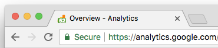

#### Google Analytics Tab Bubble

Sometimes I don't have the luxury of screen real estate and I don't want to flip between tabs often to see how many active users are on the site. This little chrome extension will provide a tiny bubble that updates with that information that's corresponding to the real-time page that's up.

Using [Tinycon](https://github.com/tommoor/tinycon).
